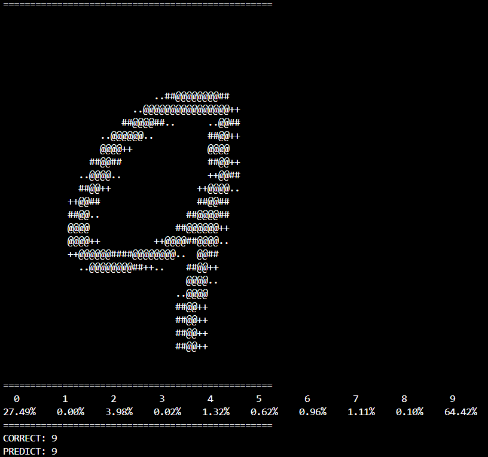
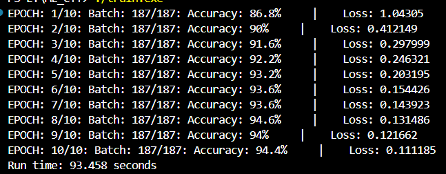

# MNIST_CPP

Neural network using C++ to classify digits from the MNIST dataset

## :bar_chart: Results

 
Dataset: MNIST dataset of torchvision (28x28 pixel images)

    
    

## :gear: Installation and Usage

- git clone https://github.com/Nguen-03/MNIST_CPP.git
- The number of dataset images could be configured in **mnist.py**
- Then type these commands in the terminal:
    - **mingw32-make** to compile the project
    - **./train.exe**
    - **./predict.exe**: print images and show result (the number of predicted images could be changed in **predict.cpp**)

## Requirements

- C++17
- MINGW / GCC(of course☝️🤓)

## How it works

1.  Input image (28x28) → flatten to vector (784)
2.  Forward pass through hidden layers
3.  (6)Output layer with Softmax
4.  Loss: Cross Entropy
5.  Backpropagation to update weights
6.  Save weight to **lmao.bin**

# Reference

- https://github.com/Magicalbat/videos/tree/main/machine-learning
